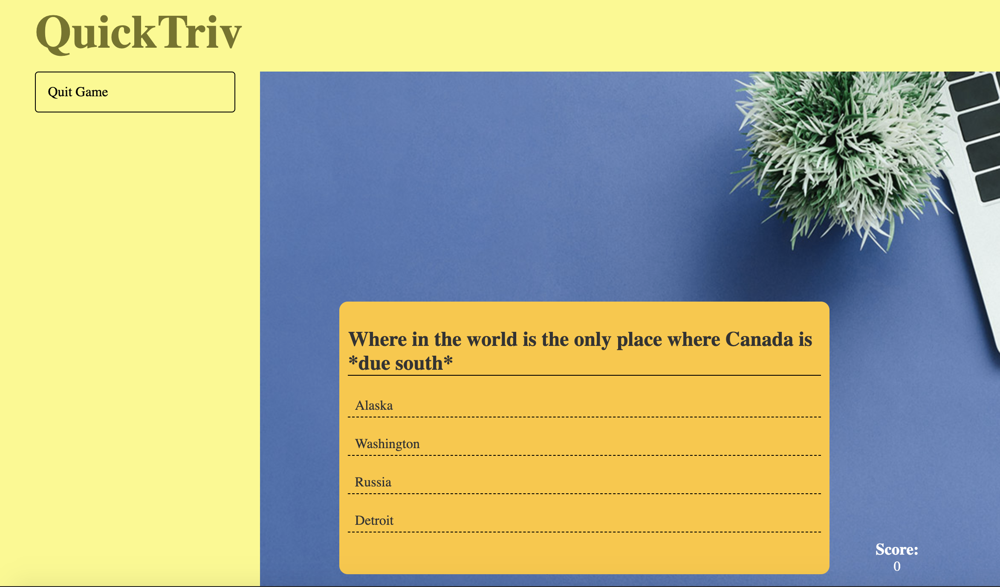

  

## Overview

QuickTriv is an application that allows you to get in a quick game of Trivia! It is a multiple choice game and allows for a timed option as well to really test your skills. 

## Instructions
* <a href="https://harryzec.github.io/Tandem_Challenge/">Live Demo</a>
* npm install
* npm start
* paste the path for index.html in Chrome

## Technologies
* JavaScript
* React.js
* CSS
* HTML
* Webpack

## Features
* Trivia Practice
* Score 
* Animation
* Timed Trivia
* See your incorrect questions
* In sync score

# Future 
* User Auth
* Upload your own trivia questions
* Leadership board for each set of questions